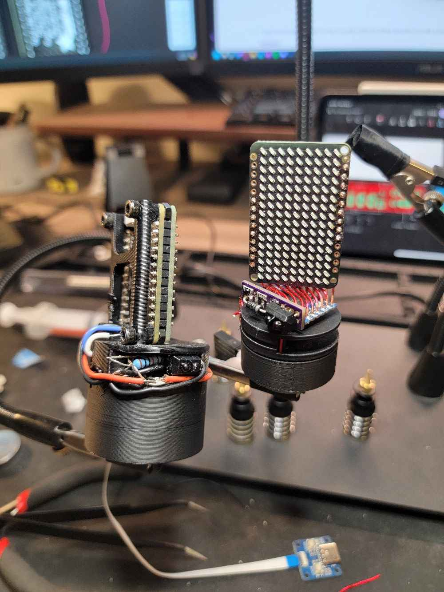
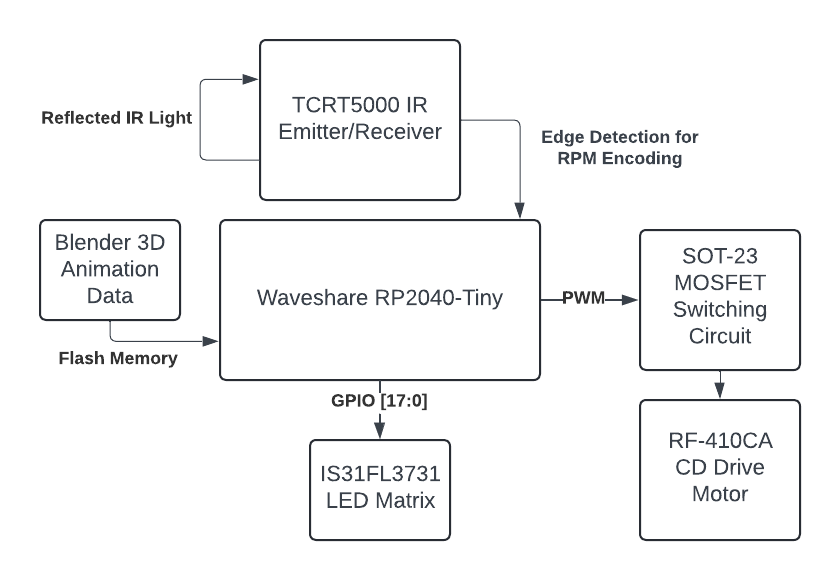
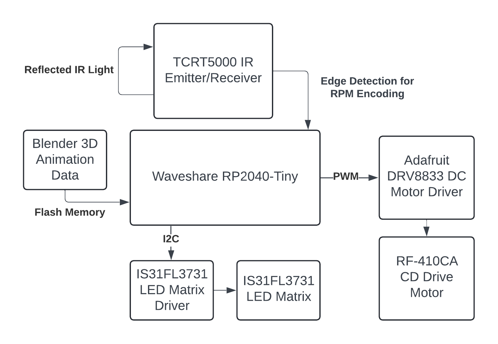

# Team Intel Engineers Volumetric Display

This is our senior project for the Fall 2024 semester at the University of Utah.

Volumetric three-dimensional displays are displays which give viewers a sense of depth and immersion
by displaying an image in a three-dimensional space. The motivation for such technology is the fact that viewers
can be more immersed into the content they are viewing. Specifically they can offer more accurate representations of three-dimensional objects. The method we are using involves taking a light emitting diode (LED) matrix and spinning it. As it’s spinning the matrix will be displaying different slices of a three dimensional image. These slices then form a three dimensional volumetric image. Our project is handheld and will display volumetric images from Blender.

Our proposal for this project can be found [here](https://drive.google.com/file/d/1ndLRNWP-nPX-9-LFJ2siUfhwasraIrXO/preview).

Our final presentation slides can be found [here](https://docs.google.com/presentation/d/1vZk0xXERd0lbI73o8EUdau5T-LTruhlxJzRkWaqgYXQ/preview).
Our final blender slides can be found [here](https://docs.google.com/presentation/d/1KxT9TL9DTWdXwFqC-N0FRyzLAdsu7cya_VM0FvRhF8w/edit?usp=sharing).

This project is based off of a similar project created by YouTube user Mitxela which can be found [here](https://github.com/mitxela/candle).
His YouTube channel can be found [here](https://www.youtube.com/@mitxela).

## Project Members

Our team is composed of three Computer Engineering students from the Department of Electrical & Computer Engineering.

#### Members
- Semrah Odobasic | u1293090 | semrahodobasic@icloud.com
- Logan Allen | u1190764 | Logan.Allen@utah.edu
- Jin Jeong   | u1375534 | djwls97865@gmail.com

## Parts List
### GPIO Implemetation
This implementation directly drives the matrix using the GPIO pins. This allows for us to change the image fast enough to show non circular volumetric images.

| Part Model            | Function                 |
|-----------------------|--------------------------|
| WaveShare RP2040 Tiny | Microcontroller          |
| Adafruit Dot Matrix   | Charlieplexed LED Matrix |
| Vishay TCRT5000       | IR Sensor                |
| MOSFET SOT-23         | Motor Driver MOSFET      |
| RF-410CA              | Motor                    |
| LIR2450 Battery       | Battery                  |
| Flyback Diode         | Flyback Motor Diode      |
| Oshpark Custom PCB    | PCB Board                |
| 3D Printed Chassis    | Display Chassis          |

Block Diagram:

### I2C Implemetation (ONLY WORKS FOR CIRCULAR IMAGES)
This implementation uses the I2C controller for the LED matrix. We have determined that this cannot switch frames fast enough to show non circular shapes. An example of a circular shape that works is a cylinder since the display just has to have one 2D frame that spins.

| Part Model            | Function                 |
|-----------------------|--------------------------|
| WaveShare RP2040 Tiny | Microcontroller          |
| Adafruit IS31FL3731   | I2C LED Matrix Controller|
| Adafruit Dot Matrix   | Charlieplexed LED Matrix |
| Vishay TCRT5000       | IR Sensor                |
| RF-410CA              | Motor                    |
| ADAFRUIT DRV8833      | Motor Driver             |
| 3D Printed Chassis    | Display Chassis          |

Block Diagram:

## Projects (Under Code-Testing)
Within the Code-Testing folder there is various projects. As we have developed the project and changed the hardware we have made new projects to keep the old code avalible for our older designs. This also includes some projects that are for testing individual component implementations and verification.

- Display GPIO - This is our full implemetation code using GPIO for display control. Timing is very strict for this implementation.
- Display - This is the first version of our full implemtation code using I2C. This code doesn't have the most accurate timing which caused issues.  
- Display V2 - This is the second version of our full implemenation code using I2C. This code works well but the I2C display isn't fast enough for what we need.  
- Matrix - Project used to do the code conversion from the C++ library into our own C library.  
- Motor - Project used to set up the motor control so that we can drive the motor.  
- Pico - Example projects downloaded from Rasperri Pi.  
- LED Onboard - This project is used to figure out how to drive the WS2818 LED that is onboard the waveshare RP2040.  

## Other Folders
Inside of this repository there are folders which are all for different aspects of the project,

- Blender - This folder includes our 3D printing files, volumetric blender data, file converter (.blend to header data), and image optimizer (no longer used).
- Documentation - This folder contains formal documentation. Mainly our proposal for the project and embedded systems proposal.
- PCB - This folder contains all of the files for our custom PCB.
- Presenetation - This folder contains our various presentation slides that we have used for this project.

## Environment Setup
### Windows
The easiest way to get the toolchain running is to install the Visual Studio Code setup from rasperry pi. It will install all of the required programs for you. It will also ask you if you want to install the pico SDK which will save you a step in the installation process. You should also install the Pico Extras addon.

- Install Pico-Visual Studio Code: https://www.raspberrypi.com/news/raspberry-pi-pico-windows-installer/  
- Install the Pico SDK: https://github.com/raspberrypi/pico-sdk

When attempting to build a file make sure the CMake filepath is set for the pico-sdk variable. You also have to set the filepath for the pico_extra variable. Ensure that you delete the build folder as you will have to do the build from scratch when starting up on a new machine.

Compiling generates a .uf2 file in the build folder. This file is the one you need to upload to the RP2040 to get the display running.